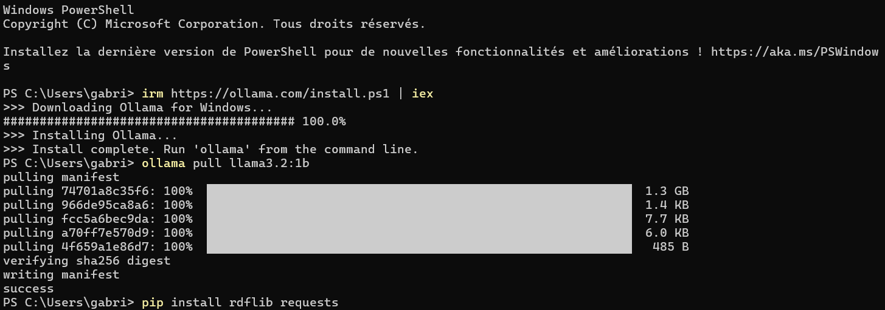
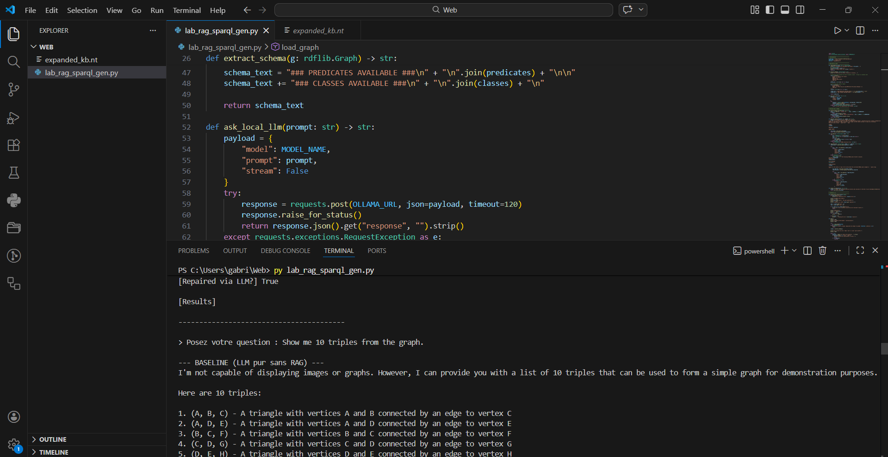

# Semantic Web & AI: Knowledge Graph Construction, Reasoning, and RAG

## 📌 Project Overview
This repository contains a complete end-to-end **Knowledge Engineering pipeline**. It covers:

* **Data acquisition** from raw web sources.
* **Named Entity Recognition (NER)**.
* **Knowledge Base alignment** with Wikidata.
* **Ontology creation**.
* **SPARQL-based** graph expansion.
* **Explicit rule-based reasoning** (SWRL).
* **Implicit continuous reasoning** (Knowledge Graph Embeddings via PyKEEN).
* **Semantic Retrieval-Augmented Generation (RAG)** interface powered by a local Small Language Model (SLM).

---

## 💻 Hardware & Software Requirements

* **OS:** Windows / Linux / macOS
* **Hardware:** * Minimum **8GB RAM** (16GB recommended for PyKEEN embedding training and local LLM execution).
    * A dedicated **GPU (CUDA)** is highly recommended for faster KGE training but not strictly required.
* **Software:**
    * **Python 3.9+**
    * **Ollama** (for running the local SLM)


## ⚙️ Installation & Environment Setup

### 1. Clone the repository
```bash
git clone [https://github.com/YourUsername/YourRepoName.git](https://github.com/YourUsername/YourRepoName.git)
cd YourRepoName
```

### 2. Set up the Python Environment
Il est fortement recommandé d'utiliser un environnement virtuel :

**Sur Linux / macOS :**
```bash
python -m venv venv
source venv/bin/activate
```

**Sur Windows :**
```powershell
python -m venv venv
venv\Scripts\activate
```

**Installer les dépendances :**
```bash
pip install -r requirements.txt
```

### 3. Install & Download the Local LLM
Assure-toi qu'**Ollama** est installé sur ta machine, puis télécharge le modèle **Llama 3.2** (1B parameters) requis :

```bash
ollama pull llama3.2:1b
```



## 🚀 How to Run the Modules

### Phase 1 to 4: Graph Construction, SWRL, and KGE
All data acquisition, alignment, SWRL rule execution, and embedding evaluations are contained within a single Jupyter Notebook.

1. **Launch Jupyter:**
   ```bash
   jupyter notebook
   ```
2. **Execute the pipeline:** Open `src/Web.ipynb` and run the cells sequentially.

> [!NOTE]
> The data outputs (such as `expanded_kb.nt` and KGE datasets) are already provided in the `data/` folder for reproducibility.

---

### Phase 5: Semantic RAG Demo (NL to SPARQL)
The RAG system translates Natural Language into SPARQL queries, executes them against our custom RDF graph, and features an automated self-repair loop for syntax errors.

1. **Prerequisite:** Ensure the **Ollama** service is running in the background.
2. **Run the interactive CLI script:**
   ```bash
   python src/lab_rag_sparql_gen.py
   ```
3. **Usage:** Type your questions directly into the terminal (e.g., *"List all the organizations present in the knowledge graph"*). Type `exit` to quit.

---

## 📸 Demo Screenshot


*(Note: Replace this placeholder with an actual screenshot of your terminal showing a successful RAG query and self-repair loop).*